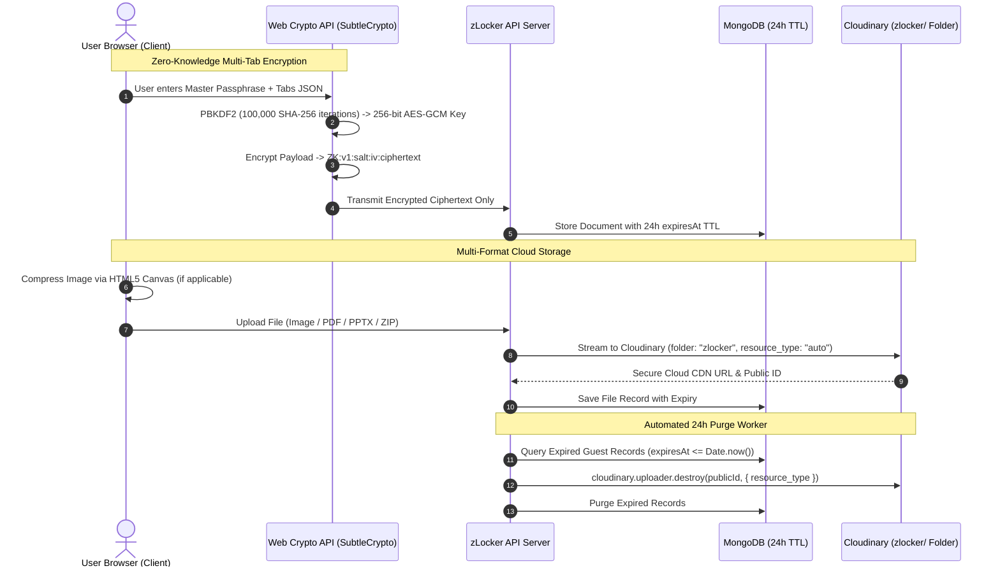

# 🔐 zLocker — Zero-Knowledge Cloud Locker & 24h Self-Destructing Guest Vault

> A privacy-first, zero-knowledge encrypted digital locker for multi-tab rich-text notes and multi-format cloud files. Built with ProtectedText-style client-side encryption and an automated 24-hour self-destructing guest engine.

---

[](https://nextjs.org/)
[](https://react.dev/)
[](https://www.typescriptlang.org/)
[](https://heroui.com/)
[](https://developer.mozilla.org/en-US/docs/Web/API/Web_Crypto_API)
[-blue?style=for-the-badge&logo=cloudinary)](https://cloudinary.com/)
[](LICENSE)

---

## 📑 Table of Contents

- [Overview](#-overview)
- [Key Features](#-key-features)
- [Architecture & Security Model](#-architecture--security-model)
- [Tech Stack](#-tech-stack)
- [Live Demo & Screenshots](#-live-demo--screenshots)
- [Prerequisites](#-prerequisites)
- [Installation & Setup](#-installation--setup)
- [Environment Variables](#-environment-variables)
- [Running Locally](#-running-locally)
- [Project Directory Structure](#-project-directory-structure)
- [API Documentation](#-api-documentation)
- [Available Scripts](#-available-scripts)
- [Subscription & Pricing Limits](#-subscription--pricing-limits)
- [Contributing](#-contributing)
- [License](#-license)
- [Author & Contact](#-author--contact)

---

## 📖 Overview

**zLocker** is a modern security-focused web platform engineered to eliminate trust requirements from cloud storage. Designed around the **ProtectedText Zero-Knowledge Architecture**, all notes and multi-tab documents are encrypted and decrypted strictly inside the user's browser using native **Web Crypto APIs (`SubtleCrypto`)**. 

The server and database never receive, process, or store unencrypted plain text or user passphrases. It offers both **Instant 24-Hour Disposable Guest Vaults** (with automated MongoDB TTL and Cloudinary asset deletion) and **Permanent Authenticated Member Vaults**.

---

## ✨ Key Features

- 🛡️ **Zero-Knowledge Client-Side Encryption (E2EE)**:
  - 256-bit **AES-GCM** encryption combined with **PBKDF2** key derivation (100,000 iterations of SHA-256).
  - Encrypted payloads follow standard format: `ZK:v1:<salt>:<iv>:<ciphertext>`.
  - Passwords never leave your device and are never stored in databases or logs.

- 🗂️ **ProtectedText-Style Multi-Tab Management**:
  - Organize multiple notes and sub-topics inside a single locker (`[Tab 1]`, `[Work]`, `[Passwords]`, `[+]`).
  - Inline tab renaming, smooth switching with zero reload lag, and unified atomic encryption.

- 🔒 **Cryptographic Password Verification**:
  - Locks new and existing lockers with password authentication tags.
  - Incorrect passphrases fail decryption locally without exposing contents.

- ⚡ **24-Hour Self-Destructing Guest Mode (No Sign-Up)**:
  - Open any custom URL (`/guest/my-vault`) or 1-click generate a random locker.
  - Strict 24-hour expiration countdown clock with manual **Self-Destruct** trigger.
  - Background purge worker destroys physical Cloudinary files and database records upon expiry.

- 📁 **Universal Multi-Format Cloud Storage**:
  - Securely uploads to the dedicated Cloudinary `zlocker/` repository.
  - Supports **Images** (`.png`, `.jpg`, `.webp`), **PDFs**, **PowerPoint** (`.pptx`), **Word** (`.docx`), **Excel** (`.xlsx`), and **ZIP Archives** (`.zip`, `.rar`, `.7z`).
  - Integrated Lightbox previewer, copy direct link, and 1-click download actions.

- ⚡ **Client-Side Image Compression**:
  - HTML5 Canvas engine auto-optimizes and compresses images prior to transmission to maximize cloud storage efficiency.

- 📝 **Advanced Rich-Text Editor**:
  - Built with **TipTap & ProseMirror** with live word and character counters.
  - Headings, Code Blocks, Quotes, Highlights, Text Alignment, Undo/Redo, and `.txt` file export.

- 💳 **3-Tier Subscription System with bKash Integration**:
  - Tiered plan activations (20 TK, 50 TK, 100 TK) with manual bKash payment verification workflow.

---

## 🏗️ Architecture & Security Model



---

## 🛠️ Tech Stack

### Frontend Client (`zLocker-client`)
- **Framework**: [Next.js 15](https://nextjs.org/) (App Router, React 19)
- **UI Components**: [HeroUI v2](https://heroui.com/) (formerly NextUI)
- **Styling**: [Tailwind CSS](https://tailwindcss.com/) & `next-themes` (Dark/Light mode)
- **State & Caching**: [@tanstack/react-query v5](https://tanstack.com/query)
- **Rich-Text Engine**: [@tiptap/react](https://tiptap.dev/) + StarterKit, Typography, Highlight
- **Client Cryptography**: Native [Web Crypto API](https://developer.mozilla.org/en-US/docs/Web/API/Web_Crypto_API) (`window.crypto.subtle`)
- **Authentication**: [@clerk/nextjs](https://clerk.com/)
- **Icons & Modals**: [lucide-react](https://lucide.dev/), [SweetAlert2](https://sweetalert2.github.io/)

### Backend Server (`zlocker-server`)
- **Runtime**: Node.js & [Express.js](https://expressjs.com/) with [TypeScript](https://www.typescriptlang.org/)
- **Database**: [MongoDB](https://www.mongodb.com/) with [Mongoose](https://mongoosejs.com/) (TTL Indexes)
- **Cloud Storage**: [Cloudinary API](https://cloudinary.com/) (`multer-storage-cloudinary`)
- **Authentication Middleware**: [@clerk/express](https://clerk.com/)
- **Email Service**: [Nodemailer](https://nodemailer.com/)

---

## 📸 Live Demo & Screenshots

| Live Web Application | API Server |
|---|---|
| 🌐 **Client URL**: [https://zlocker-kappa.vercel.app](https://zlocker-kappa.vercel.app) | ⚙️ **API Endpoint**: [https://zlocker-server.vercel.app/api](https://zlocker-server.vercel.app/api) |

---

## 📋 Prerequisites

Ensure you have the following installed on your machine:
- **Node.js**: `v18.17.0` or higher ([Download Node.js](https://nodejs.org/))
- **npm**: `v9.0.0` or higher (or `yarn` / `pnpm`)
- **MongoDB Database**: Local instance or free cluster on [MongoDB Atlas](https://www.mongodb.com/cloud/atlas)
- **Cloudinary Account**: Cloud Name, API Key, and API Secret ([Cloudinary Console](https://cloudinary.com/))
- **Clerk Account**: Publishable Key and Secret Key ([Clerk Dashboard](https://clerk.com/))

---

## ⚙️ Installation & Setup

### 1. Clone the Repositories

```bash
# Clone the client repository
git clone https://github.com/Utsho11/zLocker-client.git
cd zLocker-client

# In a separate directory, clone the backend repository
git clone https://github.com/Utsho11/zlocker-server.git
cd zlocker-server
```

---

## 🔐 Environment Variables

### Client (`zLocker-client/.env.local`)

Create a `.env.local` file in the root of `zLocker-client`:

```env
# Clerk Authentication Keys
NEXT_PUBLIC_CLERK_PUBLISHABLE_KEY=pk_test_your_clerk_publishable_key
CLERK_SECRET_KEY=sk_test_your_clerk_secret_key

# Backend API URL (without trailing slash)
NEXT_PUBLIC_BACKEND_URL=http://localhost:5000/api
```

### Server (`zlocker-server/.env`)

Create a `.env` file in the root of `zlocker-server`:

```env
NODE_ENV=development
PORT=5000

# MongoDB Database Connection String
DATABASE_URL=mongodb+srv://<username>:<password>@cluster.mongodb.net/zlocker?retryWrites=true&w=majority

# Cloudinary Storage Configuration
CLOUDINARY_CLOUD_NAME=your_cloud_name
CLOUDINARY_API_KEY=your_api_key
CLOUDINARY_API_SECRET=your_api_secret

# Clerk Authentication
CLERK_PUBLISHABLE_KEY=pk_test_your_clerk_publishable_key
CLERK_SECRET_KEY=sk_test_your_clerk_secret_key

# Encryption & Security
SECRET_KEY=your_32_character_random_server_secret_key

# Email Service (Nodemailer Contact Form)
EMAIL_USER=your_email@gmail.com
EMAIL_PASS=your_gmail_app_password

# Allowed CORS Origins (comma-separated)
ALLOWED_ORIGINS=http://localhost:3000,https://zlocker-kappa.vercel.app
```

---

## 🚀 Running Locally

### Step 1: Start the Backend Server

```bash
cd zlocker-server
npm install
npm run dev
# Server will start on http://localhost:5000
```

### Step 2: Start the Frontend Client

```bash
cd zLocker-client
npm install --legacy-peer-deps
npm run dev
# Open http://localhost:3000 in your browser
```

---

## 📂 Project Directory Structure

```text
zLocker-client/
├── app/
│   ├── dashboard/           # Unified Member Vault (Multi-Tab Notes + Cloud Locker)
│   ├── guest/               # Guest Locker Index & Dynamic [lockerId] Vault
│   ├── pricing/             # 3-Tier Subscription Table & bKash Payment Modal
│   ├── contact/             # Contact Form with Email Transmission
│   ├── layout.tsx           # Root Layout with Theme & HeroUI Providers
│   ├── icon.svg             # Next.js App Router Favicon
│   └── page.tsx             # Landing Page & Quick Guest Jump
├── components/
│   ├── NoteTabsManager.tsx  # ProtectedText-Style Multi-Tab Navigation Strip
│   ├── ContentCard.tsx      # Note Preview Card with Modal Tab Browser
│   ├── navbar.tsx           # Global Responsive Navigation Bar
│   └── rich-text-editor/    # TipTap Rich Text Editor & Toolbar
├── config/
│   ├── api.config.ts        # Centralized Dynamic Backend URL Resolver
│   └── site.ts              # Site Metadata & Navigation Config
├── hooks/
│   ├── useContent.ts        # Member Note Queries & Mutations
│   ├── useGuestLocker.ts    # Guest Locker 24h CRUD Hooks
│   └── useImageContent.ts   # Cloudinary File Upload & Storage Hooks
└── lib/
    ├── crypto.ts            # Web Crypto AES-256-GCM & PBKDF2 Engine
    └── imageCompressor.ts   # HTML5 Canvas Image Optimization Engine
```

---

## 📡 API Documentation

### Guest Endpoints (`/api/guest`)

| Method | Endpoint | Description | Payload / Params |
|---|---|---|---|
| `GET` | `/api/guest/:lockerId` | Fetch 24h guest locker notes and files | `lockerId` (string) |
| `POST` | `/api/guest/:lockerId/text` | Save encrypted multi-tab note | `{ content: "ZK:v1:..." }` |
| `POST` | `/api/guest/:lockerId/file` | Upload file to Cloudinary `zlocker/` | `multipart/form-data` (`file`) |
| `DELETE`| `/api/guest/:lockerId/file/:fileId` | Delete specific guest file from Cloudinary | `fileId` (string) |
| `DELETE`| `/api/guest/:lockerId` | Self-destruct entire guest locker | `lockerId` (string) |
| `POST` | `/api/guest/cleanup` | Trigger automated 24h asset purge | None |

### Member Endpoints (`/api`)

| Method | Endpoint | Description | Auth Required |
|---|---|---|---|
| `GET` | `/api/text/get-all-content` | Fetch member's encrypted notes | Yes (Clerk Bearer Token) |
| `POST` | `/api/text/create-content` | Create new encrypted note | Yes (Clerk Bearer Token) |
| `PUT` | `/api/text/update-content/:id` | Update existing encrypted note | Yes (Clerk Bearer Token) |
| `DELETE`| `/api/text/delete-content/:id` | Delete member note | Yes (Clerk Bearer Token) |
| `GET` | `/api/image/get-all-image` | Fetch member's Cloudinary files | Yes (Clerk Bearer Token) |
| `POST` | `/api/image/add-image` | Upload file to member Cloudinary vault | Yes (Clerk Bearer Token) |
| `DELETE`| `/api/image/delete-image/:id` | Delete file from Cloudinary and database | Yes (Clerk Bearer Token) |

---

## 📜 Available Scripts

### Client (`zLocker-client`)

```bash
# Run local development server
npm run dev

# Build production bundle
npm run build

# Start production server
npm run start

# Run ESLint validation
npm run lint
```

### Server (`zlocker-server`)

```bash
# Run development server with ts-node-dev
npm run dev

# Compile TypeScript into JavaScript
npm run build

# Start production server
npm run start
```

---

## 💎 Subscription & Pricing Limits

| Plan Tier | Price (bKash) | Max Tabs | Max Cloud Files | Image Optimization | Data Retention |
|---|---|---|---|---|---|
| **Guest Vault** | **0 TK** (Free) | **3 Tabs** | **3 Files** | Auto-Compressed | **24 Hours** (Self-Destruct) |
| **Registered Free** | **0 TK** (Free) | **5 Tabs** | **5 Files** | Auto-Compressed | **Permanent Lifetime** |
| **Basic Plan** | **20 TK** | **20 Tabs** | **20 Files** | Auto-Compressed | **Permanent Lifetime** |
| **Standard Plan** | **50 TK** | **100 Tabs** | **100 Files** | Auto-Compressed | **Permanent Lifetime** |
| **Unlimited Pro** | **100 TK** | **Unlimited** | **Unlimited** | Full Original Lossless | **Permanent Lifetime** |

- **Manual bKash Payment**: Send Money to personal bKash number `+8801521793531` and submit TrxID in the modal for instant account activation.

---

## 🤝 Contributing

Contributions, issues, and feature requests are welcome!

1. Fork the Project (`https://github.com/Utsho11/zLocker-client/fork`)
2. Create your Feature Branch (`git checkout -b feature/AmazingFeature`)
3. Commit your Changes (`git commit -m 'feat: Add some AmazingFeature'`)
4. Push to the Branch (`git push origin feature/AmazingFeature`)
5. Open a Pull Request

---

## 📄 License

Distributed under the **MIT License**. See [`LICENSE`](LICENSE) for more information.

---

## 👤 Author & Contact

**Utsho Roy**  
- **GitHub**: [@Utsho11](https://github.com/Utsho11)  
- **LinkedIn**: [Utsho Roy](https://www.linkedin.com/in/utshoroy)  
- **Email**: [utshoroy2020@gmail.com](mailto:utshoroy2020@gmail.com)  
- **Project Repository**: [https://github.com/Utsho11/zLocker-client](https://github.com/Utsho11/zLocker-client)
