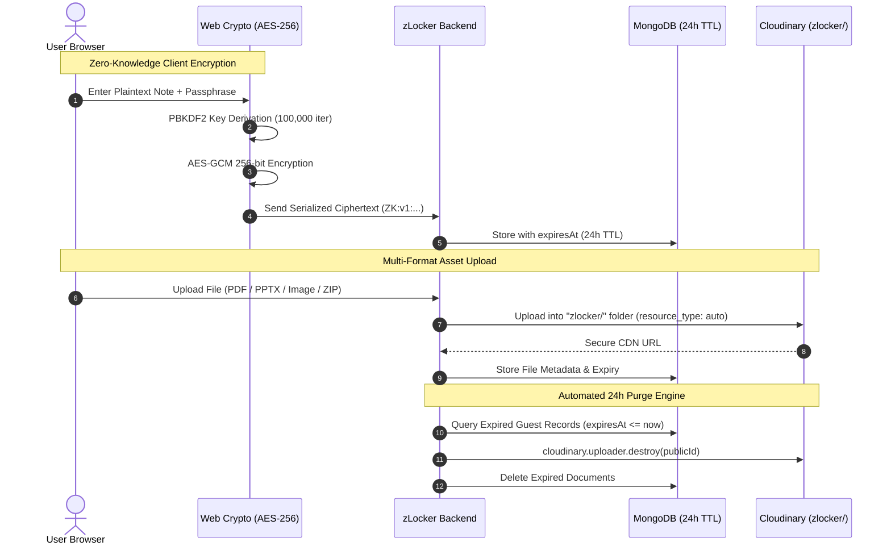

# 🔐 zLocker — Zero-Knowledge Cloud Locker & 24h Guest Vault

[](https://nextjs.org/)
[](https://heroui.com/)
[](https://developer.mozilla.org/en-US/docs/Web/API/Web_Crypto_API)
[-blue)](https://cloudinary.com/)
[](LICENSE)

**zLocker** is a privacy-first web platform and digital vault engineered with **ProtectedText-style Zero-Knowledge Client-Side Encryption** and a **24-Hour Self-Destructing Guest Mode**. It allows users to write encrypted rich-text notes and store multi-format cloud files (PDFs, PowerPoint presentations, Images, Word documents, Excel sheets, and ZIP archives) with zero server-side access to plaintext keys.

---

## 🌟 Core Highlights

### 1. 🛡️ ProtectedText-Style Zero-Knowledge Encryption (E2EE)
- **100% Client-Side**: Notes are encrypted in your browser using the native **Web Crypto API (`window.crypto.subtle`)** with **AES-GCM 256-bit** and **PBKDF2** (100,000 rounds of SHA-256).
- **Zero-Knowledge Architecture**: The server and database only ever store ciphertext (`ZK:v1:salt:iv:ciphertext`). Even with full database access, plaintext notes cannot be decrypted without your passphrase.
- **Interactive Unlock**: Encrypted notes show a 🔒 badge and prompt for the passphrase to decrypt in-memory.

### 2. ⚡ Instant 24-Hour Guest Locker (No Sign-Up)
- **Instant Access**: Jump directly into any custom URL (e.g. `/guest/my-vault`) or generate a random disposable locker.
- **Strict 24-Hour TTL**: MongoDB automatically purges expired records via TTL indexes (`expiresAt`).
- **Cloudinary File Destroyer**: An automated background cleanup worker destroys physical Cloudinary assets (`image` and `raw`) once the 24-hour expiration window closes.
- **Live Expiration Timer**: Real-time countdown clock (e.g., `⏱️ Expires in 23h 45m 12s`) with an immediate **Self-Destruct** trigger.

### 3. 📁 Universal Multi-Format Cloud Locker
- Upload and organize assets in the dedicated Cloudinary **`zlocker/`** folder:
  - 🖼️ **Images**: `.jpg`, `.png`, `.webp`, `.svg` with Lightbox viewer.
  - 📕 **PDF Documents**: `.pdf` with tab viewer and direct download.
  - 📊 **PowerPoint**: `.pptx`, `.ppt` presentations.
  - 📝 **Word & Excel**: `.docx`, `.xlsx`.
  - 🗜️ **Archives**: `.zip`, `.rar`, `.7z`.

### 4. 📝 High-Performance Rich-Text Editor
- Built on **TipTap & ProseMirror** with sub-millisecond typing responsiveness.
- Features: Live Word & Character Counter, Headings (H1-H5), Code Blocks, Blockquotes, Strikethrough, Text Alignment, Undo/Redo, and 1-Click `.txt` export.
- Real-time instant search and filter in your notes dashboard.

---

## 🏗️ Architecture & Security Model



---

## 🛠️ Technology Stack

| Layer | Technologies |
|---|---|
| **Framework** | [Next.js 15](https://nextjs.org/) (App Router, Server Components & Client Hooks) |
| **Component Library** | [HeroUI v2](https://heroui.com/) (formerly NextUI) |
| **Styling & Theme** | [Tailwind CSS](https://tailwindcss.com/) & `next-themes` (Dark/Light mode) |
| **State & Cache** | [@tanstack/react-query](https://tanstack.com/query) with optimized stale-while-revalidate |
| **Editor Engine** | [@tiptap/react](https://tiptap.dev/) + StarterKit, Typography, Highlight & TextAlign |
| **Cryptography** | Browser Native [Web Crypto API](https://developer.mozilla.org/en-US/docs/Web/API/Web_Crypto_API) (SubtleCrypto) |
| **Authentication** | [@clerk/nextjs](https://clerk.com/) |
| **Icons & Alerts** | [lucide-react](https://lucide.dev/), [SweetAlert2](https://sweetalert2.github.io/) |

---

## 🚀 Getting Started

### Prerequisites
- Node.js 18.x or higher
- Running instance of [`zlocker-server`](https://github.com/Utsho11/zlocker-server)

### Installation

1. **Clone the repository:**
   ```bash
   git clone https://github.com/Utsho11/zLocker-client.git
   cd zLocker-client
   ```

2. **Install dependencies:**
   ```bash
   npm install --legacy-peer-deps
   ```

3. **Configure Environment Variables:**
   Create a `.env.local` file in the root directory:
   ```env
   NEXT_PUBLIC_CLERK_PUBLISHABLE_KEY=pk_test_...
   CLERK_SECRET_KEY=sk_test_...
   NEXT_PUBLIC_BACKEND_URL=https://your-backend-api.vercel.app/api
   ```

4. **Run Development Server:**
   ```bash
   npm run dev
   ```

---

## 📜 License

Licensed under the [MIT License](LICENSE).
